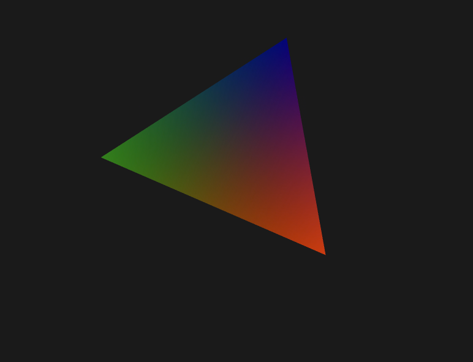

# Mobile 3D Gaussian Splatting

Cross-platform 3D Gaussian Splatting implementation with Vulkan/MoltenVK backend, targeting desktop and mobile platforms.

## Available Targets

The project provides several runnable targets and libraries:

### Executable Targets

- **`triangle`** - Vulkan triangle example showcasing the RHI (Rendering Hardware Interface) and core library integration
<p align="left">
  
</p>

- **`particles`** - GPU-accelerated particle simulation demonstrating compute shader capabilities
<p align="left">
  
</p>

- **`splat-loader`** - 3D Gaussian Splatting PLY file loader and analyzer
- **`unit-tests`** - Core library unit tests for platform utilities, memory allocators, and math functions
- **`perf-tests`** - Performance benchmarks for memory allocation, vector operations, and core library components

### Libraries

- **`core`** - Static library with foundational utilities (math, logging, timer, VFS, platform abstraction)
- **`engine`** - Static library with 3D Gaussian Splatting data structures and PLY loading functionality
- **`RHI`** - Rendering Hardware Interface static library with Vulkan backend implementation

## Windows

### Dependencies

- **CMake** v3.20+ (required by project)
- **Visual Studio 2022** - Primary supported IDE and build tools
- **Vulkan SDK** - Download and install from [LunarG](https://vulkan.lunarg.com/) with default options
  - Ensure the `VULKAN_SDK` environment variable is set automatically by the installer
- **Python 3.7+** - Required for build configuration scripts

### Build Instructions

**Step 1.** Clone the repository and navigate to the project directory:
```bash
git clone <repository-url>
cd Mobile-3D-Gaussian-Splatting
```

**Step 2.** Configure the project (Release build by default):
```bash
python scripts/configure.py
```

**Step 3.** Build and run the triangle example:
```bash
python scripts/configure.py build --target triangle --run
```

**Step 4.** (Optional) Build and run tests:
```bash
python scripts/configure.py build --tests --run
```

For Debug builds with validation layers:
```bash
python scripts/configure.py --clean --build-type Debug --validation
python scripts/configure.py build --target triangle --run
```

### Using Visual Studio (Alternative)

After configuring with the script, you can open the project in Visual Studio:

**Step 1.** Configure the project (generates Visual Studio solution):
```bash
python scripts/configure.py --build-type Debug --validation
```

**Step 2.** Open the generated solution file:
```bash
# Open in Visual Studio
start build/Mobile-3D-Gaussian-Splatting.sln
```

**Step 3.** Set the startup project to `triangle` and build/run directly from the IDE.

The configure script automatically sets `triangle` as the startup project for Visual Studio.

## Linux

### Dependencies

- **CMake** v3.20+ (install via package manager: `apt install cmake` or `dnf install cmake`)
- **GCC** 9+ or **Clang** 10+ with C++20 support
- **Vulkan development packages**:
  - Ubuntu/Debian: `sudo apt install libvulkan-dev vulkan-tools vulkan-validationlayers-dev`
  - Fedora/RHEL: `sudo dnf install vulkan-devel vulkan-tools vulkan-validation-layers-devel`
  - Arch: `sudo pacman -S vulkan-devel vulkan-tools vulkan-validation-layers`
- **Additional dependencies**:
  - `pkg-config`, `libglfw3-dev` (or equivalent for your distribution)
- **Python 3.7+** - Required for build configuration scripts

### Build Instructions

**Step 1.** Clone the repository and install dependencies:
```bash
git clone <repository-url>
cd Mobile-3D-Gaussian-Splatting

# Ubuntu/Debian
sudo apt update
sudo apt install build-essential cmake libvulkan-dev vulkan-tools vulkan-validationlayers-dev libglfw3-dev pkg-config

# Fedora/RHEL
sudo dnf install gcc-c++ cmake vulkan-devel vulkan-tools vulkan-validation-layers-devel glfw-devel pkgconfig
```

**Step 2.** Configure the project:
```bash
python3 scripts/configure.py
```

**Step 3.** Build and run the triangle example:
```bash
python3 scripts/configure.py build --target triangle --run
```

**Step 4.** (Optional) Build and run tests:
```bash
python3 scripts/configure.py build --tests --run
```

For Debug builds with validation:
```bash
python3 scripts/configure.py --clean --build-type Debug --validation
python3 scripts/configure.py build --target triangle --run
```

## macOS

### Dependencies

- **CMake** v3.20+ (Apple Silicon requires at least v3.19.2)
  - Install via Homebrew: `brew install cmake`
  - Or download from [CMake.org](https://cmake.org/download/)
- **Xcode** v12+ for Apple Silicon, v11+ for Intel
  - Install from Mac App Store or Apple Developer site
- **Command Line Tools (CLT) for Xcode**:
  ```bash
  xcode-select --install
  ```
- **Vulkan SDK** - Download and install from [LunarG](https://vulkan.lunarg.com/) with default options
  - Includes MoltenVK for Vulkan-on-Metal translation
  - Alternative: Install via Homebrew: `brew install vulkan-loader vulkan-headers`
- **Python 3.7+** - Pre-installed on macOS 10.15+, or install via Homebrew

### Build Instructions

**Step 1.** Clone the repository and navigate to the project directory:
```bash
git clone <repository-url>
cd Mobile-3D-Gaussian-Splatting
```

**Step 2.** Configure the project:
```bash
python3 scripts/configure.py
```

**Step 3.** Build and run the triangle example:
```bash
python3 scripts/configure.py build --target triangle --run
```

**Step 4.** (Optional) Build and run tests:
```bash
python3 scripts/configure.py build --tests --run
```

For Debug builds with validation layers:
```bash
python3 scripts/configure.py --clean --build-type Debug --validation
python3 scripts/configure.py build --target triangle --run
```

**Note**: For Debug builds, the script automatically generates `compile_commands.json` for IDE integration when using Unix Makefiles or Ninja generators.

### Using Xcode (Alternative)

After configuring with the script, you can open the project in Xcode:

**Step 1.** Configure the project (generates Xcode project):
```bash
python3 scripts/configure.py --generator "Xcode" --build-type Debug --validation
```

**Step 2.** Open the generated Xcode project:
```bash
# Open in Xcode
open build/Mobile-3D-Gaussian-Splatting.xcodeproj
```

**Step 3.** Select the `triangle` scheme and build/run directly from Xcode.

**Alternative IDEs:**
- **VS Code**: Use `--generator "Unix Makefiles"` and open with `code .`
- **CLion**: Open the project directory after configuration

## iOS

*Coming Soon* - iOS support is planned for future releases.

## Android

### Dependencies

- **Android NDK** r27 or later
  - Install via [Android Studio](https://developer.android.com/studio) or command line tools
  - NDK can be installed via SDK Manager: `sdkmanager 'ndk;27.0.12077973'`
  - Specify SDK path via `--sdk-path` argument, or set `ANDROID_HOME`/`ANDROID_SDK_ROOT` environment variable
  - The build system automatically selects the newest installed NDK >= r27

- **JDK** 17 or later
  - Specify path via `--jdk-path` argument, or set `JAVA_HOME` environment variable
  - Android Studio bundled JDK works fine (auto-detected if not specified)
  - Or download from [Eclipse Temurin](https://adoptium.net/) or [Oracle](https://www.oracle.com/java/technologies/downloads/)
- **Minimum Android API Level**: 24 (Android 7.0 Nougat) - Required for Vulkan 1.0 support

### Build Instructions

**Step 1.** Clone the repository and navigate to the project directory:
```bash
git clone <repository-url>
cd Mobile-3D-Gaussian-Splatting
```

**Step 2.** Build debug APK:
```bash
python scripts/configure.py android --build-type debug
```

Or with explicit SDK/JDK paths:
```bash
python scripts/configure.py android --sdk-path ~/Android/Sdk --jdk-path /path/to/jdk
```

**Step 3.** Install APK to device using adb:
```bash
adb install android/app/build/outputs/apk/debug/app-debug.apk
```

The APK will be generated at:
- Debug: `android/app/build/outputs/apk/debug/app-debug.apk`
- Release: `android/app/build/outputs/apk/release/app-release.apk`

### Android Build Options

```bash
python scripts/configure.py android [OPTIONS]
```

**Options:**
- `--build-type {debug,release}` - Build configuration (default: debug)
- `--sdk-path PATH` - Path to Android SDK (overrides ANDROID_HOME environment variable)
- `--jdk-path PATH` - Path to JDK (overrides JAVA_HOME and auto-detection)
- `--clean` - Clean build artifacts before building
- `--verbose` - Show detailed Gradle build output

### Examples

```bash
# Build debug APK (uses auto-detected SDK/JDK or environment variables)
python scripts/configure.py android

# Build release APK
python scripts/configure.py android --build-type release

# Build with explicit SDK and JDK paths
python scripts/configure.py android --sdk-path ~/Android/Sdk --jdk-path ~/.jdks/temurin-17

# Clean build with verbose output
python scripts/configure.py android --clean --build-type debug --verbose
```

### Project Structure

The Android build integrates with the main CMake project:
- [android/app/src/main/cpp/android_main.cpp](android/app/src/main/cpp/android_main.cpp) - Android native activity entry point
- [android/CMakeLists.txt](android/CMakeLists.txt) - Android-specific CMake configuration
- [android/app/build.gradle.kts](android/app/build.gradle.kts) - Gradle build configuration
- Shaders and models are automatically copied to APK assets during build

## Configure Script Options

### Configuration Options
```bash
python3 scripts/configure.py [OPTIONS]
```

- `--build-type {Debug,Release,RelWithDebInfo}` - Set build configuration (default: Release)
- `--clean` - Clean build directory before configuring
- `--validation` - Enable Vulkan validation layers (recommended for Debug builds)
- `--generator GENERATOR` - Override CMake generator (e.g., "Ninja", "Unix Makefiles")
- `--build-dir BUILD_DIR` - Specify build directory (default: "build")
- `--verbose` - Show detailed configuration output
- `--debug-mode` - Enable debug logging for configuration process

### Build Command Options
```bash
python3 scripts/configure.py build [OPTIONS]
```

- `--target TARGET` - Build specific target (can be repeated). Use `all` to build all executable targets and RHI
- `--tests` - Build test targets (unit-tests, perf-tests, and rhi-tests if available)
- `--list-targets` - List all available build targets
- `--run` - Run executable after building (single target only)
- `--clean` - Clean before building
- `--parallel N` - Number of parallel build jobs
- `--verbose` - Show detailed build output (all compiler/linker messages)

### Target Validation

The build system automatically validates that requested targets exist before attempting to build them:
- Invalid targets will show an error with available targets listed
- `--target all` filters to only build executable targets and RHI
- Libraries (core, app, engine) and shader compilation targets are excluded from `--target all`
- The `rhi-tests` target is only available when project is configured with `--tests` flag

### Examples

```bash
# Quick start with triangle example
python3 scripts/configure.py
python3 scripts/configure.py build --target triangle --run

# Run particle simulation
python3 scripts/configure.py build --target particles --run

# Load and analyze a 3D Gaussian Splatting file
python3 scripts/configure.py build --target splat-loader --run

# Debug build with validation
python3 scripts/configure.py --clean --build-type Debug --validation
python3 scripts/configure.py build --target triangle --run

# RelWithDebInfo build (Release optimization + debug symbols)
python3 scripts/configure.py --clean --build-type RelWithDebInfo
python3 scripts/configure.py build --target triangle --run

# Build all executable targets and RHI library
# Note: This builds executables from examples/ plus RHI, not static libraries or shader targets
python3 scripts/configure.py build --target all

# Build and run tests with detailed output
python3 scripts/configure.py build --tests --run --verbose

# Use Ninja generator for faster builds
python3 scripts/configure.py --generator "Ninja" --build-type Debug
python3 scripts/configure.py build --target triangle --parallel 8
```

## Alternative Build Methods

While the configure script is the recommended approach, you can also build the project using other methods:

### Direct CMake Commands

For users familiar with CMake who prefer direct control:

```bash
# Configure (replace with your preferred generator and options)
cmake -B build -S . -DCMAKE_BUILD_TYPE=Debug -DENABLE_VULKAN_VALIDATION=ON

# Build specific targets
cmake --build build --target triangle --parallel

# Build all targets
cmake --build build --parallel

# Run (requires proper working directory)
cd build/bin/Debug && ./triangle
```

### IDE Project Generation

Generate project files for your preferred IDE:

```bash
# Visual Studio (Windows)
cmake -B build -S . -G "Visual Studio 17 2022" -DCMAKE_BUILD_TYPE=Debug
start build/Mobile-3D-Gaussian-Splatting.sln

# Xcode (macOS)
cmake -B build -S . -G "Xcode" -DCMAKE_BUILD_TYPE=Debug
open build/Mobile-3D-Gaussian-Splatting.xcodeproj

# Unix Makefiles (Linux/macOS) with compile_commands.json for IDEs
cmake -B build -S . -G "Unix Makefiles" -DCMAKE_BUILD_TYPE=Debug -DCMAKE_EXPORT_COMPILE_COMMANDS=ON
```

**Note**: The configure script handles platform detection, dependency verification, and proper environment setup automatically. Direct CMake usage requires manual environment configuration and may not work on all systems without additional setup.