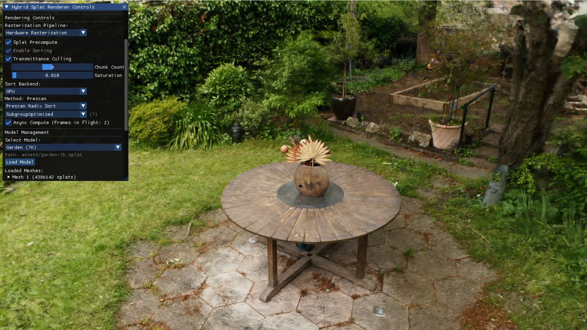
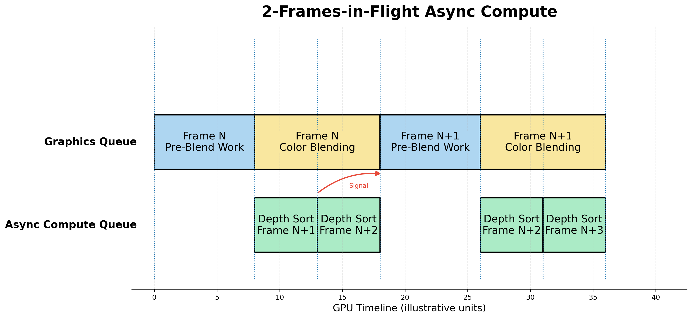
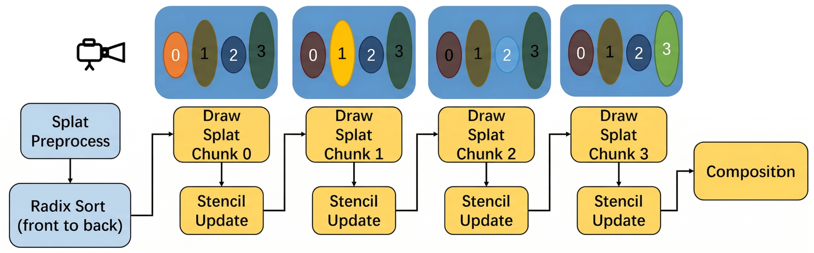
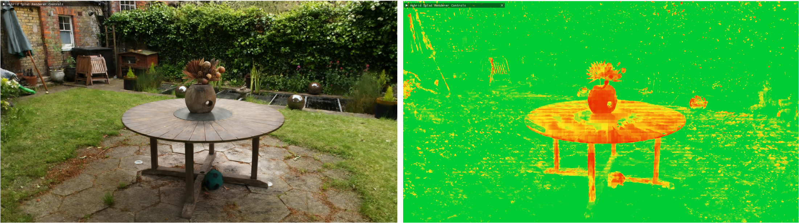

# Mobile 3D Gaussian Splatting

[](LICENSE)




Real-time high performance [3D Gaussian Splatting](https://repo-sam.inria.fr/fungraph/3d-gaussian-splatting/) renderer targeting mobile platforms (Android, iOS) with a Vulkan/MoltenVK RHI backend. Can also build and run on desktop (Windows, Linux, macOS).

## Overview

3D Gaussian Splatting represents scenes as collections of 3D Gaussians, each with a position, covariance, opacity, and view-dependent color encoded via spherical harmonics. This project implements both **compute rasterization** pipeline and **hardware rasterization** pipeline, with a focus on making 3DGS performant on mobile GPUs through the hardware rasterization path.

### Compute Rasterization

Splats are binned into screen tiles and rasterized entirely in compute shaders. The output image is blitted to the swapchain.

```
┌─────────────────────────────────────────────────────────────────────┐
│  PREPROCESS (compute shader)                                        │
│                                                                     │
│  For each Gaussian:                                                 │
│    1. Frustum cull + alpha cull                                     │
│    2. Project 3D covariance -> 2D conic + screen position           │
│    3. Evaluate SH -> view-dependent color                           │
│    4. Compute tile overlap bounding box                             │
│    5. Emit (depth key, tile ID) pairs for each tile touched         │
│                                                                     │
│  Wave-Level Allocation                                              │
│    • WaveActiveSum of tiles touched, 1 atomic per wave              │
│    • Output is a flat array of tile-instance pairs                  │
│                                                                     │
├──────────────────────────┬──────────────────────────────────────────┤
│           ▼              │                                          │
│  GPU RADIX SORT          │  Two-pass sort via indirect dispatch:    │
│  (DispatchIndirect)      │    1. Sort by depth (front-to-back)      │
│                          │    2. Re-key by tile ID, sort again      │
│                          │                                          │
│                          │                                          │
├──────────────────────────┴──────────────────────────────────────────┤
│           ▼                                                         │
│  IDENTIFY TILE RANGES (compute shader)                              │
│  Detect tile boundaries in sorted array -> per-tile [start, end)    │
│                                                                     │
├─────────────────────────────────────────────────────────────────────┤
│           ▼                                                         │
│  TILE RASTERIZE (compute shader, 16×16 threads per tile)            │
│                                                                     │
│  Per pixel: front-to-back alpha blending over tile's sorted splats  │
│    • Batch 256 splats into shared memory per iteration              │
│    • Early exit when transmittance < 1/255                          │
│    • Output: RGBA32F image                                          │
│                                                                     │
├─────────────────────────────────────────────────────────────────────┤
│           ▼                                                         │
│  BLIT TO SWAPCHAIN                                                  │
│                                                                     │
└─────────────────────────────────────────────────────────────────────┘
```

### Hardware Rasterization

A compute precompute stage culls, projects, and stream-compacts visible Gaussians into a dense buffer of 2D screen ellipses. Each visible splat is then rendered as an instanced screen-aligned quad via the standard vertex/fragment pipeline, where the vertex shader reads the precomputed ellipse data to emit billboard vertices and the fragment shader evaluates the Gaussian falloff with alpha blending.

The hardware rasterization pipeline is driven entirely from the GPU through a precompute stage that feeds into sorting, which feeds into rendering, with no CPU readback at any point:

```
┌─────────────────────────────────────────────────────────────────────┐
│  SPLAT PRECOMPUTE (compute shader)                                  │
│                                                                     │
│  For each Gaussian:                                                 │
│    1. Frustum cull + alpha cull                                     │
│    2. Project 3D covariance -> 2D screen ellipse (HWRasterSplat)    │
│    3. Compute depth sort key                                        │
│    4. Stream-compact into dense visible array                       │
│                                                                     │
│  Stream Compaction                                                  │
│    • Wave intrinsics: 1 atomic per wave (not per splat)             │
│    • Output is a dense array of visible splats only                 │
│                                                                     │
│  GPU-Driven Rendering                                               │
│    • Last workgroup writes sort dispatch + draw args                │
│    • Zero CPU readback, fully indirect pipeline                     │
│                                                                     │
├──────────────────────────┬──────────────────────────────────────────┤
│           ▼              │                                          │
│  GPU RADIX SORT          │  Sorts depth keys via indirect dispatch  │
│  (DispatchIndirect)      │  using visible count from precompute     │
│                          │                                          │
├──────────────────────────┴──────────────────────────────────────────┤
│           ▼                                                         │
│  INSTANCED QUAD DRAW                                                │
│  (DrawIndexedIndirect)     Reads precomputed HWRasterSplat data     │
│                            + sorted indices                         │
│                                                                     │
└─────────────────────────────────────────────────────────────────────┘
```

#### Async Compute (optional)



After profiling, we noticed that color blending takes almost half of the render pass time on mobile. While the ROP is busy blending, the GPU ALUs are mostly sitting idle. That gives us an opportunity to overlap the next frame's precompute + sort with the current frame's color blending on a dedicated compute queue.

- K-buffered resources with QFOT synchronization
- Warmup phase (K frames with `WaitIdle`) then transitions to fully pipelined semaphore-based execution

#### Chunked Transmittance Culling (optional)

Native transmittance culling on hardware rasterization pipeline requires framebuffer fetch to read accumulated tile alpha mid-draw. On mobile tile-based GPUs, this is relatively efficient because the shader processor can read the pixel value directly from the tile buffer. In contrast, IMR GPUs have to flush the ROP cache back to GL2 and then reload the texture value through TCP.

The main issue with mid-draw framebuffer fetch is that GPU threads have to be serialized according to primitive order. A later thread cannot start until the previous one has finished writing the current pixel, because the scoreboard must preserve API ordering. This turns the shader execution into a critical section, which can significantly hurt performance. And another problem is the corresponding Vulkan extension (`VK_EXT_rasterization_order_attachment_access`) is poorly supported on mobile.

Thus, we design a chunked approach using early stencil test for transmittance culling, the RAW dependency only exists at chunk (subpass) boundaries:

- Invert sorting to render the global splat array front-to-back (requires one additional composition pass)
- Divide the sorted primitive stream into discrete, manageable chunks for incremental rendering
- Use stencil buffer updates to mark pixels when accumulated transmittance drops below the termination threshold
- Subsequent chunks use early-stencil testing, allowing the GPU to skip fragment shading and blending entirely for saturated pixels



Heatmap visualizing the savings from transmittance culling:



### Performance

On last-generation flagship mobile GPUs (Snapdragon 8 Elite / Exynos 2500) at 3200x1440 resolution, the hardware rasterization pipeline achieves 60 FPS on small scenes like Flower (562K splats) and 30 FPS on large-scale scenes like Garden (4.38M splats).

### Key Features

- Native 3DGS tile-based compute rasterization implemented entirely in Vulkan compute shaders
- Fully GPU-driven hardware rasterization pipeline: compute precompute with wave-level stream compaction writes indirect dispatch and draw arguments directly to GPU buffers
- Float16 packed colors and SH coefficients for bandwidth reduction
- High-performance GPU radix sorter, plus a CPU sort backend as a correctness reference
- Async compute to hide sorting latency, chunked transmittance culling to reduce fragment workload on hardware rasterization
- Multi-frame-in-flight with per-frame resource arrays (UBOs, descriptor sets, command lists, fences, semaphores)
- Dynamic multi-mesh scene management with per-mesh model transforms
- Android surface pre-rotation handling to avoid compositor overhead
- GPU timestamp profiling, pipeline statistics, and buffer memory tracking with VMA gap analysis
- PLY and `.splat` file loading with coordinate system normalization
- Configurable SH degree via specialization constants

### Libraries

- **`core`** - Static library with foundational utilities (math, logging, timer, VFS, platform abstraction)
- **`engine`** - Static library with 3D Gaussian Splatting data structures and PLY loading functionality
- **`RHI`** - Rendering Hardware Interface static library with Vulkan backend implementation

## Windows

### Dependencies

- **CMake** v3.20+
- **Vulkan SDK** - Download and install from [LunarG](https://vulkan.lunarg.com/) with default options
  - Requires Vulkan 1.3+ or `VK_KHR_dynamic_rendering` extension support
  - Ensure the `VULKAN_SDK` environment variable is set automatically by the installer
- **Python 3.7+** - Required for build configuration scripts

### Build Instructions

**Step 1.** Clone the repository and navigate to the project directory:
```bash
git clone <repository-url>
cd Mobile-3D-Gaussian-Splatting
```

**Step 2.** Configure the project (Release build by default):
```bash
python scripts/configure.py
```

**Step 3.** Build and run the 3DGS renderer:
```bash
python scripts/configure.py build --target 3dgs-renderer --run
```

**Step 4.** (Optional) Build and run tests:
```bash
python scripts/configure.py build --tests --run
```

For Debug builds with validation layers:
```bash
python scripts/configure.py --clean --build-type Debug --validation
python scripts/configure.py build --target 3dgs-renderer --run
```

### Using Visual Studio (Alternative)

After configuring with the script, you can open the project in Visual Studio:

**Step 1.** Configure the project (generates Visual Studio solution):
```bash
python scripts/configure.py --build-type Debug --validation
```

**Step 2.** Open the generated solution file:
```bash
# Open in Visual Studio
start build/Mobile-3D-Gaussian-Splatting.sln
```

**Step 3.** Set the startup project to `3dgs-renderer` and build/run directly from the IDE.

The configure script automatically sets `3dgs-renderer` as the startup project for Visual Studio.

## Linux

### Dependencies

- **CMake** v3.20+ (install via package manager: `apt install cmake` or `dnf install cmake`)
- **GCC** 9+ or **Clang** 10+ with C++20 support
- **Vulkan development packages**:
  - Ubuntu/Debian: `sudo apt install libvulkan-dev vulkan-tools vulkan-validationlayers-dev`
  - Fedora/RHEL: `sudo dnf install vulkan-devel vulkan-tools vulkan-validation-layers-devel`
  - Arch: `sudo pacman -S vulkan-devel vulkan-tools vulkan-validation-layers`
- **Additional dependencies**:
  - `pkg-config`, `libglfw3-dev` (or equivalent for your distribution)
- **Python 3.7+** - Required for build configuration scripts

### Build Instructions

**Step 1.** Clone the repository and install dependencies:
```bash
git clone <repository-url>
cd Mobile-3D-Gaussian-Splatting

# Ubuntu/Debian
sudo apt update
sudo apt install build-essential cmake libvulkan-dev vulkan-tools vulkan-validationlayers-dev libglfw3-dev pkg-config

# Fedora/RHEL
sudo dnf install gcc-c++ cmake vulkan-devel vulkan-tools vulkan-validation-layers-devel glfw-devel pkgconfig
```

**Step 2.** Configure the project:
```bash
python3 scripts/configure.py
```

**Step 3.** Build and run the 3DGS renderer:
```bash
python3 scripts/configure.py build --target 3dgs-renderer --run
```

**Step 4.** (Optional) Build and run tests:
```bash
python3 scripts/configure.py build --tests --run
```

For Debug builds with validation:
```bash
python3 scripts/configure.py --clean --build-type Debug --validation
python3 scripts/configure.py build --target 3dgs-renderer --run
```

## macOS

### Dependencies

- **CMake** v3.20+ (Apple Silicon requires at least v3.19.2)
  - Install via Homebrew: `brew install cmake`
  - Or download from [CMake.org](https://cmake.org/download/)
- **Xcode** v12+ for Apple Silicon, v11+ for Intel
  - Install from Mac App Store or Apple Developer site
- **Command Line Tools (CLT) for Xcode**:
  ```bash
  xcode-select --install
  ```
- **Vulkan SDK** - Download and install from [LunarG](https://vulkan.lunarg.com/) with default options
  - Includes MoltenVK for Vulkan-on-Metal translation
  - Alternative: Install via Homebrew: `brew install vulkan-loader vulkan-headers`
- **Python 3.7+** - Pre-installed on macOS 10.15+, or install via Homebrew

### Build Instructions

**Step 1.** Clone the repository and navigate to the project directory:
```bash
git clone <repository-url>
cd Mobile-3D-Gaussian-Splatting
```

**Step 2.** Configure the project:
```bash
python3 scripts/configure.py
```

**Step 3.** Build and run the 3DGS renderer:
```bash
python3 scripts/configure.py build --target 3dgs-renderer --run
```

**Step 4.** (Optional) Build and run tests:
```bash
python3 scripts/configure.py build --tests --run
```

For Debug builds with validation layers:
```bash
python3 scripts/configure.py --clean --build-type Debug --validation
python3 scripts/configure.py build --target 3dgs-renderer --run
```

**Note**: For Debug builds, the script automatically generates `compile_commands.json` for IDE integration when using Unix Makefiles or Ninja generators.

### Using Xcode (Alternative)

After configuring with the script, you can open the project in Xcode:

**Step 1.** Configure the project (generates Xcode project):
```bash
python3 scripts/configure.py --generator "Xcode" --build-type Debug --validation
```

**Step 2.** Open the generated Xcode project:
```bash
# Open in Xcode
open build/Mobile-3D-Gaussian-Splatting.xcodeproj
```

**Step 3.** Select the `3dgs-renderer` scheme and build/run directly from Xcode.

**Alternative IDEs:**
- **VS Code**: Use `--generator "Unix Makefiles"` and open with `code .`
- **CLion**: Open the project directory after configuration

## iOS

*Coming Soon* - iOS support is planned for future releases.

## Android

### Dependencies

- **Android NDK** r27 or later
  - Install via [Android Studio](https://developer.android.com/studio) or command line tools
  - NDK can be installed via SDK Manager: `sdkmanager 'ndk;27.0.12077973'`
  - Specify SDK path via `--sdk-path` argument, or set `ANDROID_HOME`/`ANDROID_SDK_ROOT` environment variable
  - The build system automatically selects the newest installed NDK >= r27

- **JDK** 17 or later
  - Specify path via `--jdk-path` argument, or set `JAVA_HOME` environment variable
  - Android Studio bundled JDK works fine (auto-detected if not specified)
  - Or download from [Eclipse Temurin](https://adoptium.net/) or [Oracle](https://www.oracle.com/java/technologies/downloads/)
- **Minimum Android API Level**: 24 (Android 7.0 Nougat) - Required for Vulkan 1.0 support

### Build Instructions

**Step 1.** Clone the repository and navigate to the project directory:
```bash
git clone <repository-url>
cd Mobile-3D-Gaussian-Splatting
```

**Step 2.** Build debug APK:
```bash
python scripts/configure.py android --build-type debug
```

Or with explicit SDK/JDK paths:
```bash
python scripts/configure.py android --sdk-path ~/Android/Sdk --jdk-path /path/to/jdk
```

**Step 3.** Install APK to device using adb:
```bash
adb install android/app/build/outputs/apk/debug/app-debug.apk
```

The APK will be generated at:
- Debug: `android/app/build/outputs/apk/debug/app-debug.apk`
- Release: `android/app/build/outputs/apk/release/app-release.apk`

### Android Build Options

```bash
python scripts/configure.py android [OPTIONS]
```

**Options:**
- `--build-type {debug,release}` - Build configuration (default: debug)
- `--sdk-path PATH` - Path to Android SDK (overrides ANDROID_HOME environment variable)
- `--jdk-path PATH` - Path to JDK (overrides JAVA_HOME and auto-detection)
- `--clean` - Clean build artifacts before building
- `--verbose` - Show detailed Gradle build output

### Examples

```bash
# Build debug APK (uses auto-detected SDK/JDK or environment variables)
python scripts/configure.py android

# Build release APK
python scripts/configure.py android --build-type release

# Build with explicit SDK and JDK paths
python scripts/configure.py android --sdk-path ~/Android/Sdk --jdk-path ~/.jdks/temurin-17

# Clean build with verbose output
python scripts/configure.py android --clean --build-type debug --verbose
```

### Project Structure

The Android build integrates with the main CMake project:
- [android/app/src/main/cpp/android_main.cpp](android/app/src/main/cpp/android_main.cpp) - Android native activity entry point
- [android/CMakeLists.txt](android/CMakeLists.txt) - Android-specific CMake configuration
- [android/app/build.gradle.kts](android/app/build.gradle.kts) - Gradle build configuration
- Shaders and models are automatically copied to APK assets during build

## Configure Script Options

### Configuration Options
```bash
python3 scripts/configure.py [OPTIONS]
```

- `--build-type {Debug,Release,RelWithDebInfo}` - Set build configuration (default: Release)
- `--clean` - Clean build directory before configuring
- `--validation` - Enable Vulkan validation layers (recommended for Debug builds)
- `--generator GENERATOR` - Override CMake generator (e.g., "Ninja", "Unix Makefiles")
- `--build-dir BUILD_DIR` - Specify build directory (default: "build")
- `--verbose` - Show detailed configuration output
- `--debug-mode` - Enable debug logging for configuration process

### Build Command Options
```bash
python3 scripts/configure.py build [OPTIONS]
```

- `--target TARGET` - Build specific target (can be repeated). Use `all` to build all executable targets and RHI
- `--tests` - Build test targets (unit-tests, perf-tests, and rhi-tests if available)
- `--list-targets` - List all available build targets
- `--run` - Run executable after building (single target only)
- `--clean` - Clean before building
- `--parallel N` - Number of parallel build jobs
- `--verbose` - Show detailed build output (all compiler/linker messages)

### Target Validation

The build system automatically validates that requested targets exist before attempting to build them:
- Invalid targets will show an error with available targets listed
- `--target all` filters to only build executable targets and RHI
- Libraries (core, app, engine) and shader compilation targets are excluded from `--target all`
- The `rhi-tests` target is only available when project is configured with `--tests` flag

### Examples

```bash
# Quick start with 3DGS renderer
python3 scripts/configure.py
python3 scripts/configure.py build --target 3dgs-renderer --run

# Debug build with validation
python3 scripts/configure.py --clean --build-type Debug --validation
python3 scripts/configure.py build --target 3dgs-renderer --run

# RelWithDebInfo build (Release optimization + debug symbols)
python3 scripts/configure.py --clean --build-type RelWithDebInfo
python3 scripts/configure.py build --target 3dgs-renderer --run

# Build all executable targets and RHI library
# Note: This builds executables from examples/ plus RHI, not static libraries or shader targets
python3 scripts/configure.py build --target all

# Build and run tests with detailed output
python3 scripts/configure.py build --tests --run --verbose

# Use Ninja generator for faster builds
python3 scripts/configure.py --generator "Ninja" --build-type Debug
python3 scripts/configure.py build --target 3dgs-renderer --parallel 8
```

## Alternative Build Methods

While the configure script is the recommended approach, you can also build the project using other methods:

### Direct CMake Commands

For users familiar with CMake who prefer direct control:

```bash
# Configure (replace with your preferred generator and options)
cmake -B build -S . -DCMAKE_BUILD_TYPE=Debug -DENABLE_VULKAN_VALIDATION=ON

# Build specific targets
cmake --build build --target 3dgs-renderer --parallel

# Build all targets
cmake --build build --parallel

# Run (requires proper working directory)
cd build/bin/Debug && ./3dgs-renderer
```

### IDE Project Generation

Generate project files for your preferred IDE:

```bash
# Visual Studio (Windows)
cmake -B build -S . -G "Visual Studio 17 2022" -DCMAKE_BUILD_TYPE=Debug
start build/Mobile-3D-Gaussian-Splatting.sln

# Xcode (macOS)
cmake -B build -S . -G "Xcode" -DCMAKE_BUILD_TYPE=Debug
open build/Mobile-3D-Gaussian-Splatting.xcodeproj

# Unix Makefiles (Linux/macOS) with compile_commands.json for IDEs
cmake -B build -S . -G "Unix Makefiles" -DCMAKE_BUILD_TYPE=Debug -DCMAKE_EXPORT_COMPILE_COMMANDS=ON
```

**Note**: The configure script handles platform detection, dependency verification, and proper environment setup automatically. Direct CMake usage requires manual environment configuration and may not work on all systems without additional setup.