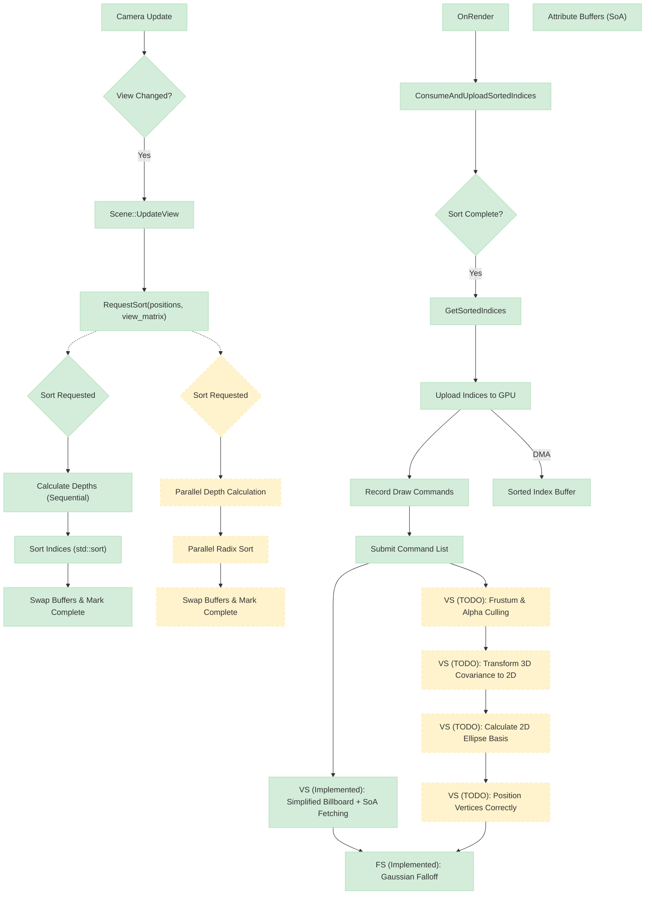

# Design: Naive CPU-Based Gaussian Splatting Renderer

This document outlines the design and implementation of the naive CPU-based Gaussian Splatting renderer. It details the current implementation and outlines future improvements based on advanced techniques found in production-level renderers like nvpro-samples.

## 1. Host-Side Architecture (C++)

**Status: Implemented**

The C++ architecture is designed to minimize latency by offloading the expensive sorting process to a separate thread, allowing the main render thread to continue preparing the next frame. This is achieved through a combination of dedicated classes for sorting, scene management, and application lifecycle.

### 1.1. Core Engine Component: `SplatSorter`

**Status: Implemented (Basic single-threaded version)**

The `SplatSorter` class is the heart of the CPU-based sorting. It is implemented using the PIMPL idiom to hide threading details from the caller.

-   **Responsibilities**:
    -   **Asynchronous Sorting**: It spawns a dedicated worker thread upon construction. This thread waits on a condition variable, consuming sort requests from the main thread.
    -   **Non-Blocking API**: The `RequestSort()` method is non-blocking. It copies the necessary data (splat positions and view matrix), sets a flag, and notifies the worker thread. If a sort is already in progress, the new request is ignored to prevent a backlog.
    -   **Depth Calculation**: The worker thread calculates the depth of each splat by projecting its world-space position onto the camera's forward vector (the third column of the view matrix).
    -   **Sorting**: It performs a standard `std::sort` on an index buffer, using the calculated depths to sort splats from front to back (for correct alpha blending).
    -   **Double Buffering**: Two index buffers are used. The worker thread writes to a "producer" buffer. Once complete, it atomically swaps a pointer, making this buffer the "consumer" buffer, which is available to the main thread. This prevents data races and ensures the main thread always has a complete, valid set of indices.
    -   **Graceful Shutdown**: The destructor signals the worker thread to stop and joins it, ensuring no resources are leaked.

#### Future Improvements (TODO)

-   **Parallelize Sorting**: The current implementation's worker thread is single-threaded. The nvpro-samples implementation demonstrates significant performance gains by parallelizing both the distance calculation and the sorting algorithm itself using `std::execution::par_unseq` and custom parallel batching. This is a critical next step for improving performance on multi-core CPUs.

### 1.2. Integration with `engine::Scene`

**Status: Implemented**

The `Scene` class acts as the primary manager for all splat-related data and operations, abstracting the complexity of the sorting and GPU data management.

-   **Ownership**: The `Scene` owns the `SplatSorter` instance, linking its lifetime to the scene's.
-   **GPU Resource Management**: `Scene::GpuData` holds `rhi::BufferHandle`s for all necessary GPU buffers, including splat attributes and the `sorted_indices` buffer that will be rendered.
-   **Orchestration Methods**:
    -   `UpdateView()`: Called by the application when the camera moves. It forwards the request to the `SplatSorter`.
    -   `ConsumeAndUploadSortedIndices()`: Called each frame by the application. It checks `SplatSorter::IsSortComplete()` and, if new indices are available, retrieves them via `GetSortedIndices()` and uploads them to the corresponding GPU buffer.

### 1.3. Application Flow (`NaiveSplatCpuApp`)

**Status: Implemented**

The `NaiveSplatCpuApp` class implements the `app::IApplication` interface, providing the main entry point and managing the render loop.

-   **Initialization (`OnInit`)**:
    1.  Initializes the RHI device and swapchain.
    2.  Creates the `Scene` and uses `SplatLoader` to load a `.ply` file.
    3.  Allocates and uploads the static splat attribute data to the GPU.
    4.  Creates the graphics pipeline, including shaders, descriptor sets (for UBO and SSBOs), and vertex layouts for a simple quad used for instancing.
    5.  Initializes the camera and synchronization primitives (fences/semaphores).
-   **Update Loop (`OnUpdate`)**:
    1.  Updates the camera based on user input.
    2.  Calls `Scene::UpdateView()` to trigger a new sort if the camera has moved.
-   **Render Loop (`OnRender`)**:
    1.  Waits for the prior frame's GPU work to complete.
    2.  Updates the `FrameUBO` with the latest camera matrices.
    3.  Calls `Scene::ConsumeAndUploadSortedIndices()` to update the GPU index buffer with the latest sorted data.
    4.  Records and submits a command buffer that draws a single quad mesh, instanced for every splat, using the sorted index buffer to fetch splat attributes in the correct order.

#### Optimization: Instanced Rendering Implementation

**Status: Implemented**

The rendering approach successfully uses GPU instancing to draw all splats efficiently with a single draw call.

-   **Current Architecture**:
    -   **Base Geometry**: A simple quad mesh with 4 vertices and 6 indices (2 triangles), stored in vertex and index buffers.
    -   **Instancing**: Each splat is rendered as a separate instance of this quad.
    -   **Per-Instance Data**: The vertex shader uses `gl_InstanceIndex` to look up the splat index from the sorted indices buffer, then fetches its attributes from the corresponding attribute buffers.

-   **RHI Support**: The `IRHICommandList` interface provides `DrawIndexedInstanced(indexCount, instanceCount, firstIndex, vertexOffset, firstInstance)` which is fully implemented in the Vulkan backend.

-   **Actual Draw Call**: The application issues a single instanced draw call per frame:
    ```cpp
    // From naive_splat_cpu_app.cpp:187
    cmdList->DrawIndexedInstanced(static_cast<uint32_t>(g_quadIndices.size()), 
                                  m_scene->GetTotalSplatCount(), 0, 0, 0);
    ```
    This will draw the 6-index quad with an instance for every splat, using the sorted index buffer to ensure correct back-to-front rendering order for alpha blending.

-   **Performance Benefit**: Instanced rendering is a critical optimization. A single draw call with an instance count is significantly more efficient than submitting thousands of separate draw calls, reducing CPU-side overhead and allowing the GPU to process all splats in parallel.

### 1.4. Asynchronous Execution and Synchronization

**Status: Implemented**

The implementation successfully hides sorting latency by creating a three-stage pipeline that operates in parallel:

-   **Sort Thread**: Sorts the splats for Frame N+1 using the latest camera view.
-   **Main Thread**: Prepares and submits the command buffer for Frame N, using the sorted indices that were finalized during the previous frame (N-1).
-   **GPU**: Renders Frame N-1, using the indices that were uploaded two frames prior.

This pipelining ensures that the main thread is not blocked waiting for the sort to complete, maximizing throughput.

## 2. Data Flow Diagram

**Status: Implemented & Planned**

The diagram illustrates the full data flow, distinguishing between currently implemented components and planned future improvements.



## 3. Shader Architecture (GLSL)

### 3.1. Data Input

**Status: Implemented**

Data is passed from the C++ host to the shaders via a UBO and multiple SSBOs using a Structure-of-Arrays (SoA) layout, managed through a single descriptor set.

-   **UBO (`FrameUBO`, binding 0)**: Contains frame-uniform data like the view-projection matrix, camera position, and viewport parameters. This is updated once per frame on the CPU.
-   **SSBO (`Positions`, binding 1)**: Read-only buffer containing all splat positions (vec3). Uploaded once during initialization.
-   **SSBO (`Scales`, binding 2)**: Read-only buffer containing all splat scales (vec3). Uploaded once during initialization.
-   **SSBO (`Rotations`, binding 3)**: Read-only buffer containing all splat rotations as quaternions (vec4). Uploaded once during initialization.
-   **SSBO (`Colors`, binding 4)**: Read-only buffer containing all splat colors (vec3). Uploaded once during initialization.
-   **SSBO (`SH Coefficients`, binding 5)**: Optional read-only buffer containing Spherical Harmonics data for view-dependent appearance. Size depends on SH degree (e.g., 48 floats per splat for degree 3). Uploaded once during initialization.
-   **SSBO (`SortedIndices`, binding 6)**: Read-only buffer containing splat indices sorted back-to-front from the camera. This buffer is dynamically updated whenever the CPU sorting thread completes a new sort based on camera movement.

### 3.2. Vertex Shader (`raster.vert`)

#### Implemented Approach: Simplified Billboard

**Status: Implemented**

The current vertex shader uses a simplified, non-perspective-correct billboard approach suitable for initial testing.

-   **Workflow**:
    1.  Uses `gl_InstanceIndex` to look up the actual splat index from the `SortedIndices` SSBO.
    2.  Uses this splat index to fetch the full attributes for the current instance from the `SplatAttributes` SSBO.
    3.  Transforms the splat's 3D center from world space to clip space using the `view_projection` matrix from the UBO.
    4.  Generates a quad by adding a fixed-size 2D offset (`in_pos * 0.05`) to the clip-space center. This creates a square that always faces the camera but does not correctly represent the splat's elliptical shape, scale, or rotation.
    5.  Passes the splat's color and the vertex's UV coordinates to the fragment shader.

#### Optimization: Data Layout Architecture

**Status: Implemented**

The shader's data layout is correctly aligned with the engine's Structure-of-Arrays (SoA) memory organization.

-   **Current Implementation (SoA)**: The vertex shader (`raster.vert`) correctly uses a Structure-of-Arrays layout with separate buffers for each attribute type:
    ```glsl
    // Actual SoA layout in raster.vert
    layout(set = 0, binding = 1, std430) readonly buffer Positions { vec3 positions[]; };
    layout(set = 0, binding = 2, std430) readonly buffer Scales { vec3 scales[]; };
    layout(set = 0, binding = 3, std430) readonly buffer Rotations { vec4 rotations[]; };
    layout(set = 0, binding = 4, std430) readonly buffer SH_Coefficients { float sh_coeffs[]; };
    layout(set = 0, binding = 5, std430) readonly buffer Opacities { float opacities[]; };
    layout(set = 0, binding = 6, std430) readonly buffer SortedIndices { uint indices[]; };
    ```

-   **Engine Architecture (SoA)**: The `engine::Scene` class uses a **Structure-of-Arrays (SoA)** layout, storing each attribute type in a separate GPU buffer. This is highly efficient for CPU-side sorting, which only needs to access the `positions` buffer.

-   **Proper Integration**: The application (`NaiveSplatCpuApp`) correctly binds each of the SoA buffers from `Scene::GpuData` to the corresponding descriptor set bindings, ensuring proper data flow between CPU and GPU.

-   **Architectural Benefits**: The SoA layout provides optimal performance because it significantly improves CPU sorting efficiency (only positions are needed, reducing cache pressure) and provides more flexible and efficient data access patterns on the GPU.

#### Future Improvements: Perspective-Correct Rendering (TODO)

**Status: Not Implemented**

A correct implementation, as seen in nvpro-samples, is required for accurate rendering. This involves transforming the 3D Gaussian into a 2D ellipse on the screen.

-   **High-Level Workflow**:
    1.  **Transform 3D Covariance**: In the vertex shader, transform the splat's 3D covariance matrix (reconstructed from its scale and rotation attributes) into a 2D covariance matrix. This requires the model-view matrix (`W`) and the Jacobian of the projection matrix (`J`) to account for perspective distortion. The formula is `Cov2D = transpose(T) * Cov3D * T`, where `T = W * J`.
    2.  **Find 2D Basis**: Solve for the eigenvalues and eigenvectors of the 2D covariance matrix. The eigenvectors represent the axes of the 2D ellipse, and the eigenvalues determine its size along those axes.
    3.  **Calculate Final Vertex Position**: Use the computed eigenvectors (basis vectors) and eigenvalues (scaling) to transform the quad's corner vertices. This correctly scales and orients the quad to match the projected shape of the Gaussian splat.
    4.  **Add Culling**: Implement frustum and alpha culling by generating degenerate triangles for culled splats, preventing them from reaching the fragment shader.

### 3.3. Fragment Shader (`raster.frag`)

**Status: Implemented**

The fragment shader simulates the appearance of a 2D Gaussian splat.

-   **Workflow**:
    1.  Calculates the squared distance of the fragment from the center of the quad (`dot(in_uv, in_uv)`).
    2.  Discards any fragment outside a unit circle (`dist_sq > 1.0`), effectively clipping the quad to a circular shape.
    3.  Applies an exponential falloff (`exp(-0.5 * dist_sq)`) to the incoming alpha value, creating the characteristic soft, Gaussian density profile.
    4.  The final color is output with the modulated alpha, ready for blending.