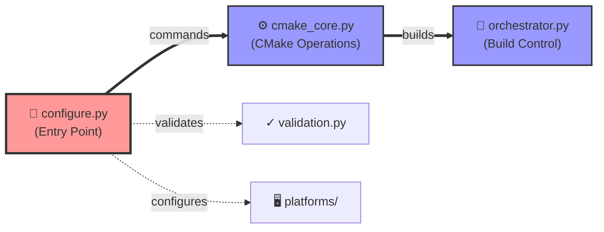
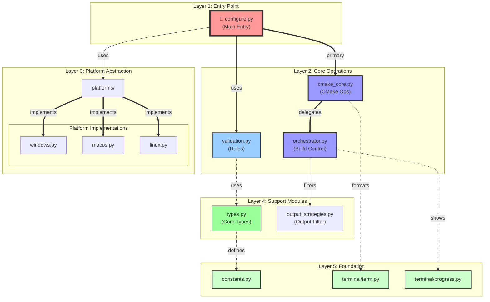
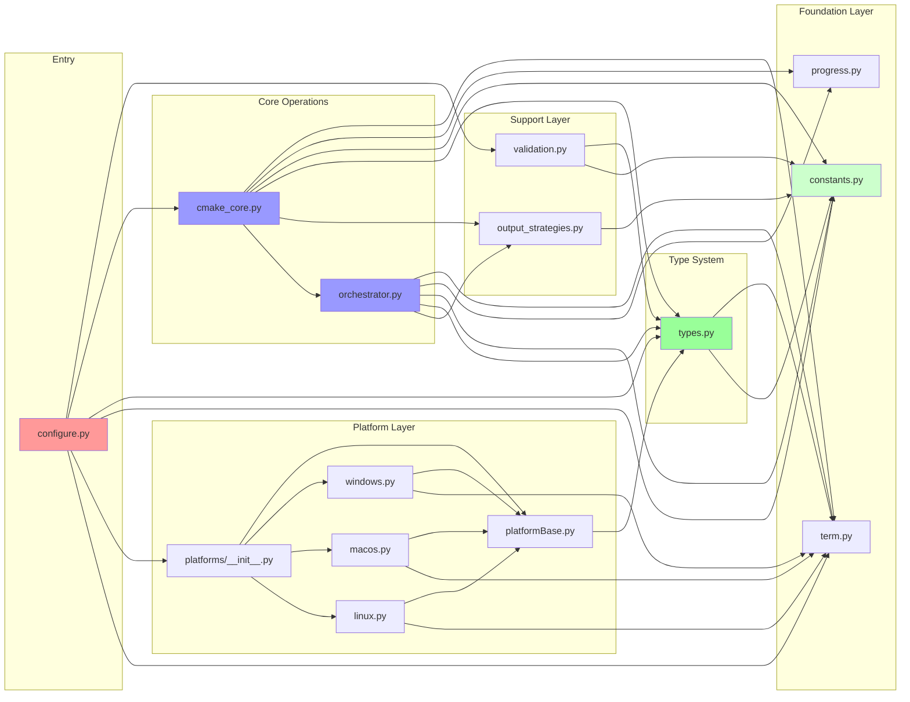

# Module Architecture Documentation

This document describes the module dependencies and architecture for the build configuration system.

## Module Overview

The build configuration system is organized into several specialized modules that work together to provide a robust cross-platform build solution.

## High-Level Architecture

### Simplified Main Flow

### Layered Architecture

## Detailed Module Dependencies

### Complete Dependency Graph

## Dependency Legend

- **Thick arrows (==>)**: Primary control flow
- **Normal arrows (-->)**: Direct dependencies
- **Dotted arrows (-.->)**: Utility/formatting dependencies
- **Colors**:
  - 🔴 Red: Entry point
  - 🔵 Blue: Core operations
  - 🟢 Green: Foundation/support modules
  - ⬜ Light: Platform-specific code

## Module Purposes

### Core Modules

- **configure.py**: Main entry point and command-line interface. Orchestrates all modules and implements the command pattern for configure/build operations.

- **constants.py**: Centralized build constants, messages, and configuration values. No dependencies on other project modules.

- **types.py**: Core type definitions including error classes, Result<T> type, enums, and build-related data structures. Depends on terminal/term.py and constants.py.

### Terminal Modules

- **terminal/term.py**: Terminal formatting, colors, and output utilities. Base module with no dependencies.

- **terminal/progress.py**: Progress indicators with spinning animations and elapsed time display for long-running operations. No dependencies on other project modules.

### Build Operation Modules

- **cmake_core.py**: CMake-specific operations and utilities including configuration, target discovery, and executable running. This is the main CMake interface module.

- **orchestrator.py**: Build process orchestration with single-responsibility methods. Manages the complete build lifecycle with comprehensive error handling.

- **validation.py**: Validation rules framework for checking build configurations, paths, and command arguments.

- **output_strategies.py**: Output filtering strategies for managing build output verbosity levels (errors, warnings, info, verbose).

### Platform Modules

- **platforms/**: Platform-specific configurations for Windows, macOS, and Linux.
  - **platformBase.py**: Abstract base class defining the platform configuration interface
  - **windows.py**: Windows-specific build configuration and Visual Studio detection
  - **macos.py**: macOS-specific configuration with Vulkan/MoltenVK setup
  - **linux.py**: Linux-specific configuration with package detection

## Dependency Flow

1. **Base modules** (no dependencies):
   - terminal/term.py
   - terminal/progress.py
   - constants.py

2. **Core types** (minimal dependencies):
   - types.py → terminal/term.py, constants.py

3. **Platform layer**:
   - platformBase.py → types.py
   - Platform implementations → platformBase.py, terminal/term.py

4. **Validation layer**:
   - validation.py → types.py, constants.py

5. **Output management**:
   - output_strategies.py → constants.py

6. **Build orchestration**:
   - orchestrator.py → types.py, constants.py, output_strategies.py, terminal modules

7. **CMake operations**:
   - cmake_core.py → All above modules plus orchestrator.py

8. **Main interface**:
   - configure.py → Orchestrates all modules

## Design Principles

1. **Single Responsibility**: Each module has a clear, focused purpose
2. **Dependency Inversion**: Higher-level modules depend on abstractions (types.py)
3. **Separation of Concerns**: UI, business logic, and platform code are separated
4. **Progressive Enhancement**: Base functionality with optional progress indicators
5. **Platform Abstraction**: Platform differences hidden behind common interface

## Module Communication

- **Result<T> Pattern**: Used for error handling throughout the system
- **Strategy Pattern**: Output filtering uses strategy pattern for different verbosity levels
- **Command Pattern**: Main configure.py uses command pattern for different operations
- **Abstract Factory**: Platform configuration uses factory pattern for platform selection